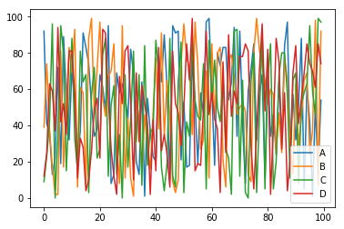
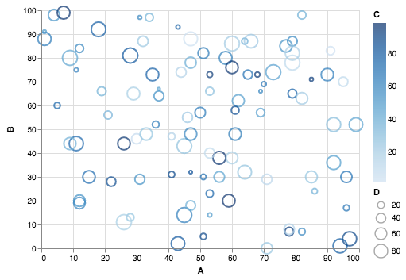

[](https://microbadger.com/images/0xmjk/mini-jupyterlab "Get your own image badge on microbadger.com")

# 0xmjk/mini-jupyterlab
[0xmjk/mini-jupyterlab](https://github.com/0xmjk/mini-jupyterlab) is a mini Docker container to start you up with working in the [JupyterLab](https://github.com/jupyterlab/jupyterlab) environment.


## Running
Start with:
```shell
docker run -ti -v jupyterlab:/home/jupyterlab/persisted -p 8888:8888 0xmjk/mini-jupyterlab:latest
```

This will start the container using `jupyterlab` local Docker volume mounted in `persisted` folder.
It will be listening on port 8888.

Open a URL from docker's output (like the one below) in your browser:
```
Copy/paste this URL into your browser when you connect for the first time,
    to login with a token:
        http://(9da9087a71fc or 127.0.0.1):8888/?token=e65085e9281c8b493b611beeec1e2931741d9c669d181120
```


## Example
The following notebook can be found as [README.ipynb](http://127.0.0.1:8888/lab/tree/README.ipynb) in your environment.


```python
import pandas as pd
import numpy as np
```

Generate a `DataFrame` with four columns containing random integers:


```python
df = pd.DataFrame(np.random.randint(0,100,size=(100, 4)), columns=list('ABCD'))
df.head()
```


<table border="1" class="dataframe">
  <thead>
    <tr style="text-align: right;">
      <th></th>
      <th>A</th>
      <th>B</th>
      <th>C</th>
      <th>D</th>
    </tr>
  </thead>
  <tbody>
    <tr>
      <th>0</th>
      <td>92</td>
      <td>39</td>
      <td>9</td>
      <td>12</td>
    </tr>
    <tr>
      <th>1</th>
      <td>41</td>
      <td>74</td>
      <td>23</td>
      <td>25</td>
    </tr>
    <tr>
      <th>2</th>
      <td>36</td>
      <td>38</td>
      <td>42</td>
      <td>63</td>
    </tr>
    <tr>
      <th>3</th>
      <td>13</td>
      <td>17</td>
      <td>96</td>
      <td>59</td>
    </tr>
    <tr>
      <th>4</th>
      <td>22</td>
      <td>2</td>
      <td>0</td>
      <td>37</td>
    </tr>
  </tbody>
</table>


Enable `matplotlib` to output into this notebook:


```python
%matplotlib inline
```


```python
df.plot()
```


    <matplotlib.axes._subplots.AxesSubplot at 0x7ffa6f6cb828>





Import [altair](https://altair-viz.github.io/index.html) and use all columns to create a random bubbles:


```python
import altair as alt
```


```python
alt.Chart(df).mark_point().encode(
    x='A',
    y='B',
    color='C',
    size='D'
)
```



